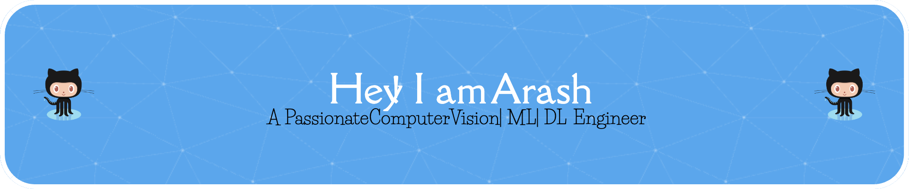

  
  

    
  

  <h1>Hi, I'm Arash Keshavarz! 👋</h1>
  <h3>🚀 Deep Learning Researcher | Computer Vision Engineer</h3>
  
  

    🔬 Specializing in <b>Hyperspectral Image Analysis</b> 
    📚 Exploring <b>Vision-Language Models (VLMs)</b>
  

  
  

<h2 align="center">🛠️ Tech Stack</h2>

  
<b>Artificial Intelligence & Computer Vision</b>

  
    

  
<b>MLOps, Cloud & Data Versioning</b>

  
  
  
  
    

  
<b>Languages & Tools</b>

  

 

<h2 align="center">⚡ GitHub Analytics</h2>

  
  
    
  
  

    
    
  

  
  

