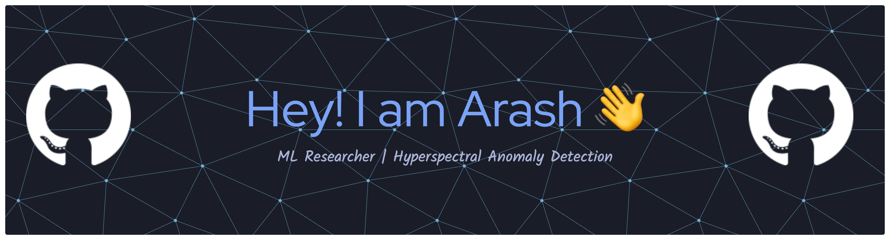

  

  <table border="0" width="100%">
    <tr>
      <td>
        <h1>Hi, I'm Arash Keshavarz! </h1>
        
      </td>
      <td align="right" valign="center">
        
      </td>
    </tr>
  </table>

  

    🔬 Currently working on <b>Hyperspectral Imaging (HSI) for physiological monitoring and anomaly detection</b> 
    🧠 Exploring <b>self-supervised representation learning and meta-learning for cross-domain HSI generalization</b> 
    📄 Published research on <b>hematoma age estimation from hyperspectral images using CNNs</b> · Journal of Imaging (2026)
  

  
  

<h2 align="center">🛠️ Tech Stack</h2>

  
<b>AI, ML & Deep Learning</b>

  
    

  
<b>Hyperspectral & Computer Vision</b>

  
  
  
  
    

  
<b>MLOps & Cloud</b>

  
  
  
  
  
    

  
<b>Languages & Tools</b>

  

 

<h2 align="center">🔬 Research Highlights</h2>

  <table border="0" width="90%">
    <tr>
      <td align="center" width="33%">
        <b>Hyperspectral Anomaly Detection</b> 
        Spatial-spectral CNN for hematoma age estimation · Band selection reducing 204 channels to task-relevant subset · +30% accuracy over baseline · Published in <i>Journal of Imaging</i> (2026)
      </td>
      <td align="center" width="33%">
        <b>Cross-Domain HSI Generalization</b> 
        Investigating domain shift in physiological HSI data across subjects and acquisition conditions · Exploring self-supervised representation learning and meta-learning for robust cross-site models
      </td>
      <td align="center" width="33%">
        <b>EIT-based Muscle Force Estimation</b> 
        ML pipeline for thigh force prediction from electrical impedance tomography · Custom 16-electrode wearable sensor belt · M.Sc. Thesis · University of Rostock
      </td>
    </tr>
  </table>

 

<h2 align="center">⚡ GitHub Analytics</h2>

  

    
    
  

   

  

    

  

 
